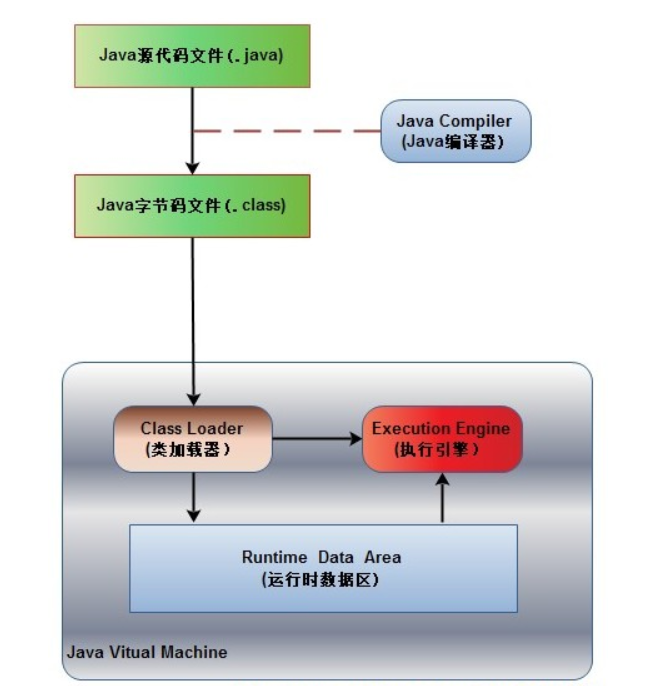

# 谈谈Java内存模型
### Java程序执行流程
* 1.Java源程序（.java文件）通过Java编译器（Java Compiler）编译成Java字节码文件（.class文件）
* 2.由Java虚拟机（JVM,Java Vitual Machine）中的类加载器（Class Loader）加载各个类的字节码文件
* 3.加载完成后，交由JVM执行引擎（Execution Engine）执行，执行引擎找到入口方法main()开始执行
* 4.在整个程序执行过程中，JVM会用一段空间来存储程序执行期间需要用到的数据和相关信息，该空间被称为Running Data Area(运行时数据区)

--------------------------------------------------
该题目主要就是分析运行时数据区

### 运行时数据区的五个组成部分
根据JVM规范，JVM内存共分为虚拟机栈JVM Stack，堆Heap，方法区、程序计数器、本地方法栈

#### 1.虚拟机栈（线程栈）和堆（Heap）
我们可以简单认为Java内存模型把虚拟机内部划分为线程栈和堆.

每一个运行在Java虚拟机里的线程都拥有自己的线程栈，这个线程栈包含了这个线程调用的方法和房前执行点相关的信息，
一个线程仅能访问自己的线程栈。一个线程创建的本地变量其他线程不可见，仅自己可见，
即使两个线程执行同样的代码，这两个线程任然在在自己的线程栈中的代码来创建本地变量。
因此，每个线程拥有每个本地变量的独有版本。

所有原始类型的本地变量都存放在线程栈上，因此对其它线程不可见。一个线程可能向另一个线程传递一个原始类型变量的拷贝，
但是它不能共享这个原始类型变量自身。

堆上包含在Java程序中创建的所有对象，无论是哪一个对象创建的。这包括原始类型的对象版本。如果一个对象被创建然后赋值给一个局部变量，
或者用来作为另一个对象的成员变量，这个对象任然是存放在堆上。

#### 2.程序计数器
程序计数器是一块较小的内存空间，可以看作是当前线程所执行的字节码的行号指示器。
分支、循环、跳转、异常处理、线程恢复等基础功能都需要依赖这个计数器来完成。

由于Java 虚拟机的多线程是通过线程轮流切换并分配处理器执行时间的方式来实现的，
在任何一个确定的时刻，一个处理器（对于多核处理器来说是一个内核）只会执行一条线程中的指令。
因此，为了线程切换后能恢复到正确的执行位置，每条线程都需要有一个独立的程序计数器，各条线程之间的计数器互不影响，独立存储，我们称这类内存区域为“线程私有”的内存。

如果线程正在执行的是一个Java 方法，这个计数器记录的是正在执行的虚拟机字节码指令的地址；
如果正在执行的是Natvie 方法，这个计数器值则为空（Undefined）。

此内存区域是唯一一个在Java 虚拟机规范中没有规定任何OutOfMemoryError情况的区域。

#### 3.本地方法栈
本地方法栈（Native MethodStacks）与虚拟机栈所发挥的作用是非常相似的，
其区别不过是虚拟机栈为虚拟机执行Java 方法（也就是字节码）服务，
而本地方法栈则是为虚拟机使用到的Native 方法服务。虚拟机规范中对本地方法栈中的方法使用的语言、
使用方式与数据结构并没有强制规定，因此具体的虚拟机可以自由实现它。
甚至有的虚拟机（譬如Sun HotSpot 虚拟机）直接就把本地方法栈和虚拟机栈合二为一。

与虚拟机栈一样，本地方法栈区域也会抛出StackOverflowError和OutOfMemoryError异常。

#### 4.方法区
为了龙清楚方法区那么需要解释两个名词：永久代和元空间
##### PermGen(永久代)
Java程序员应该都见过“java.lang.OutOfMemoryError: PremGen space”异常。
这里的“PermGen space”其实指的就是方法区。不过方法区和“PermGen space”又有着本质的区别。
前者是JVM的规范，而后者则是JVM规范的一种实现，并且只有HotSpot才有“PermGen space”，
而对于其他类型的虚拟机，如JRockit(Oracle)、J9(IBM)并没有“PermGen space”。
由于方法区主要存储类的相关信息，所以对于动态生成类的情况比较容易出现永久代的内存溢出。
并且JDK 1.8中参数PermSize和MaxPermSize已经失效。
##### 元空间

其实，移除永久代的工作从JDK 1.7就开始了。JDK 1.7中，存储在永久代的部分数据就已经转移到Java Heap或者Native Heap。
但永久代仍存在于JDK 1.7中，并没有完全移除，譬如符号引用(Symbols)转移到了native heap；
字面量(interned strings)转移到了Java heap；类的静态变量(class statics)转移到了Java heap。

JDK1.8对JVM架构的改造将类元数据放到本地内存中，另外，将常量池和静态变量放到Java堆里。
HotSpot VM将会为类的元数据明确分配和释放本地内存。在这种架构下，
类元信息就突破了原来-XX:MaxPermSize的限制，现在可以使用更多的本地内存。
这样就从一定程度上解决了原来在运行时生成大量类造成经常Full GC问题，
如运行时使用反射、代理等。所以升级以后Java堆空间可能会增加。

元空间的本质和永久代类似，都是对JVM规范中方法区的实现。
不过元空间与永久代之间的最大区别在于：
元空间并不在虚拟机中，而是使用本地内存。

> [参考链接](https://blog.csdn.net/laomo_bible/article/details/83067810)

